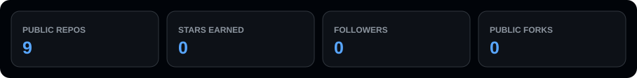
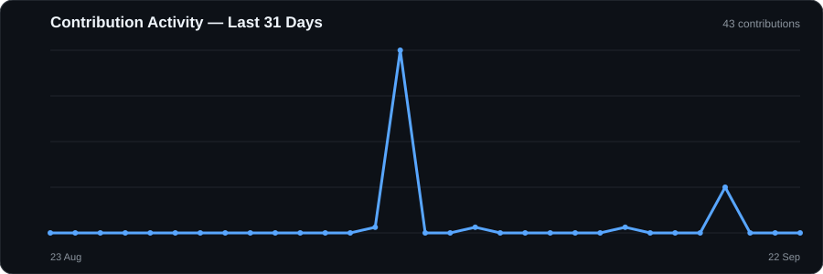

<!--
  Professional GitHub Profile README for @Dulina2002
  Keep this file in the repository: Dulina2002/Dulina2002
-->

<div align="center">

# Hi 👋, I'm Dulina Fonseka

### Full-Stack • Mobile • AI • Software Development

<a href="https://git.io/typing-svg">
  
</a>

<br/>

<a href="https://github.com/Dulina2002">
  
</a>
<a href="https://github.com/Dulina2002?tab=followers">
  
</a>
<a href="https://github.com/Dulina2002?tab=repositories">
  
</a>

</div>

---

## 👨‍💻 About Me

```text
💻 Building      Full-Stack Web, Mobile & Software Applications
🤖 Exploring     AI-powered products and intelligent systems
🧠 Learning      Advanced Software Engineering & Data Science concepts
🤝 Open to       Full-Stack, Mobile, AI & Software collaborations
💬 Ask me about  React, Java, Python, SQL, APIs & Application Development
⚡ Mindset        Build practical solutions. Learn continuously. Improve every release.
```

---

## 🧰 Tech Stack

<div align="center">

### Languages


### Frontend & Mobile


### Backend, Databases & Tools


</div>

---

## 📊 GitHub Analytics

<div align="center">




</div>

### ⚡ Auto-Updating Repository Metrics

<div align="center">



</div>


---

## 🔥 Contribution Streak

<div align="center">


</div>

---
## 📈 Contribution Activity Graph

<div align="center">



</div>

---

## 🧭 Commit & Contribution Timeline

<div align="center">


</div>

---

## 🐍 Contribution Commit Graph

<picture>
  <source media="(prefers-color-scheme: dark)" srcset="https://raw.githubusercontent.com/Dulina2002/Dulina2002/output/github-contribution-grid-snake-dark.svg" />
  <source media="(prefers-color-scheme: light)" srcset="https://raw.githubusercontent.com/Dulina2002/Dulina2002/output/github-contribution-grid-snake.svg" />
  
</picture>

---

## 🚀 Featured Projects

<table>
<tr>
<td width="33%" valign="top">

### ⚖️ LexAI
AI-powered legal assistance platform focused on clear and accessible digital legal experiences.

**Stack:** React • Vite • Tailwind CSS • Clerk • AI/RAG


</td>
<td width="33%" valign="top">

### 🏨 LuxeVista Resort
Mobile resort experience covering accommodation, bookings, services and guest interactions.

**Stack:** Android • Java • XML • Material UI


</td>
<td width="33%" valign="top">

### 🛒 Gadget Hub
Service-oriented application for distributor quotation comparison, ordering and product workflows.

**Stack:** ASP.NET Core • REST APIs • SQL Server • JavaScript


</td>
</tr>
</table>

<div align="center">

<a href="https://github.com/Dulina2002?tab=repositories">
  
</a>

</div>

<!--
WHEN YOUR PROJECT REPOSITORIES ARE PUBLIC:
Replace the project title with a real repository link, for example:

### [⚖️ LexAI](https://github.com/Dulina2002/YOUR-REAL-REPOSITORY-NAME)

Do not add a repository URL until that repository actually exists.
-->

---

## 🤝 Connect With Me

<div align="center">

<a href="https://www.linkedin.com/in/dulina-fonseka/">
  
</a>
<a href="mailto:dulinafonseka11@gmail.com">
  
</a>
<a href="https://www.instagram.com/dulina_nadith_fonseka/">
  
</a>
<a href="https://www.youtube.com/@dulinafonseka8930">
  
</a>

</div>

---

<div align="center">

### 💡 Build • Learn • Improve • Repeat

<sub>Thanks for visiting my GitHub profile.</sub>

</div>
